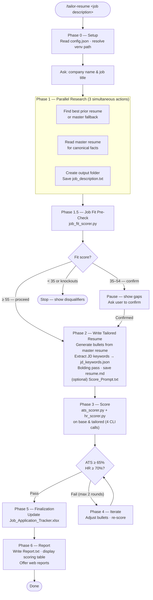

# AI Resume Builder

An AI-powered resume tailoring and job application system that runs entirely inside Claude Code.

---

## Motivation

Tailoring a resume for every job posting is tedious, error-prone, and hard to scale. ATS systems reject good candidates on keyword mismatches. Applying to roles that are a poor fit wastes everyone's time.

This project automates the entire workflow: screen jobs before you apply, tailor your resume to pass both ATS and human reviewers, generate a cover letter, and track everything in one place — all from a single slash command.

**Origin:** This is a local-first fork of an existing Resume Builder project. The Pro cloud account and billing layer were removed, the LLM scorer was replaced with a manual Claude.ai prompt workflow (no API key required), DOCX output was dropped in favor of Markdown, and all user-facing workflows were surfaced as Claude Code slash commands.

---

## Features

- **Dual-engine scoring** — ATS keyword matching + HR cognitive simulation score every tailored resume
- **Job fit pre-screening** — knockout detection flags hard disqualifiers before you write a word
- **Resume tailoring** — rewrites your master resume against a job description, targeting 65%+ ATS and 70%+ HR scores
- **Cover letter generation** — produces a personalized cover letter from the same context
- **Job discovery** — searches Adzuna, USAJobs, and TheirStack and ranks results against your profile

---

## Prerequisites

- **Python 3.10+**
- **Claude Code** (CLI or desktop app)
- **A virtual environment** in the project root (any name). The `.gitignore` is set up for `venv` — use that name or update `.gitignore` to match yours.
- **API keys** (optional, for job discovery — see Configuration below)

---

## Setup

```bash
# 1. Clone the repo
git clone <repo-url>

# 2. Create your virtual environment
python -m venv venv

# 3. Open the project in Claude Code and run:
/setup
```

`/setup` will create `config.json`, install dependencies into your virtual environment, and prompt you for your contact details.

---

## Commands

| Command | Description |
|---------|-------------|
| `/setup` | One-time initialization: venv, dependencies, config |
| `/tailor-resume` | Tailor your resume to a job description (full pipeline) |
| `/cover-letter` | Generate a cover letter only |
| `/writing-coach` | Get feedback on resume writing quality |
| `/find-jobs` | Search for jobs and score them against your profile |
| `/master-resume` | Start a master resume editing session |

---

## How `/tailor-resume` Works



---

## Configuration

### `config.json`

Created automatically by `/setup`. To adjust settings afterward, edit it directly.

| Field | Description |
|-------|-------------|
| `venv_name` | Your virtual environment folder name |
| `master_resume_path` | Path to your master resume file |
| `output_base_dir` | Where application folders are written (default: `applications`) |
| `user_name` | Your full name |
| `user_credentials` | Optional credentials suffix (e.g., `M.D., MBA`) |
| `user_email` | Contact email |
| `user_phone` | Contact phone |
| `user_linkedin` | LinkedIn profile URL |
| `generate_score_prompt` | If `true`, writes a `Score_Prompt.txt` you can paste into Claude.ai for a free LLM score |

### `.env` — API keys for job discovery

```
ADZUNA_APP_ID=
ADZUNA_APP_KEY=
USAJOBS_API_KEY=
USAJOBS_EMAIL=
THEIRSTACK_API_KEY=
```

Job discovery works with any combination of these — sources with missing keys are skipped.

---

## Output

Each `/tailor-resume` run creates a folder under `applications/`:

```
applications/
└── Acme Corp - Data Analyst/
    ├── resume.md           # Tailored resume (final deliverable)
    ├── cover_letter.md     # Generated cover letter
    ├── job_description.txt # Original JD (reference copy)
    ├── jd_keywords.json    # Claude-extracted JD keywords used for ATS scoring
    ├── Report.txt          # ATS + HR score breakdown
    └── Score_Prompt.txt    # (if enabled) Paste into Claude.ai for LLM scoring
```

All applications are also logged to `Job_Application_Tracker.xlsx`.

---

## Notes

**Platform support:** Windows, macOS, and Linux. Python paths are resolved from `config.json` at runtime, so the venv name is portable across platforms.
